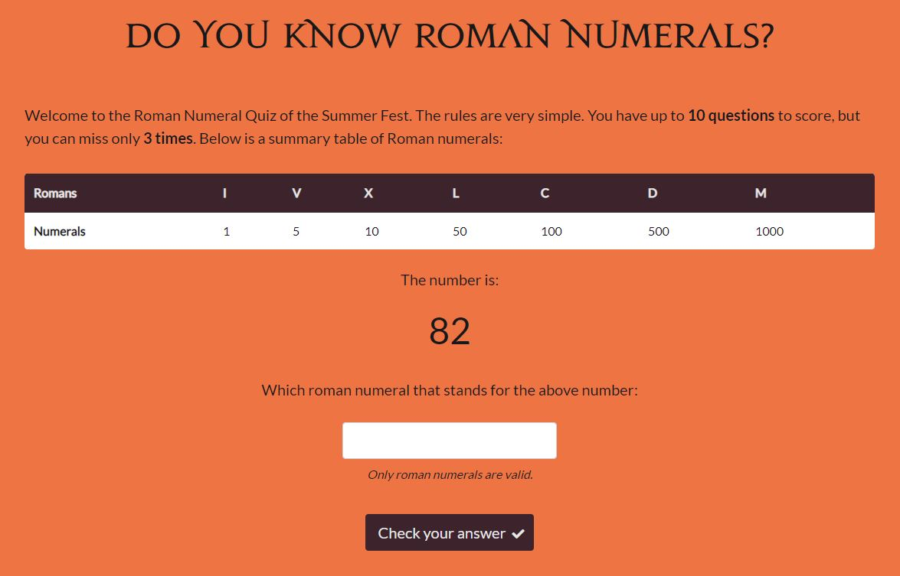
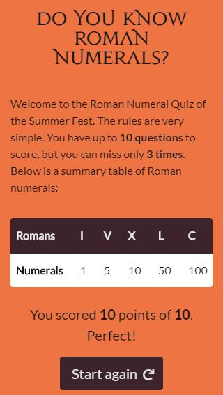

# Quiz Application
 
Quiz application develop using JavaScript
  

**Developed using**
  
HTML5
CSS/SASS/Boostrap
FontAwesome
JavaScript
Gulp

**Instructions for testing**
 
1) Clone the project;
2) Run npm install;
3) Open index.html.

 

**UI**

  

  

